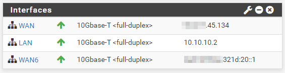

- [1. Docker and IPv6 Securely](#1-docker-and-ipv6-securely)
  - [1.1. Diagram](#11-diagram)
  - [1.2. Objectives](#12-objectives)
    - [1.2.1. Automatic provisioning of IPv6](#121-automatic-provisioning-of-ipv6)
    - [1.2.2. Security](#122-security)
      - [1.2.2.1. Out of band Firewall](#1221-out-of-band-firewall)
  - [1.3. Requirements](#13-requirements)
  - [1.4. Hypervisor](#14-hypervisor)
  - [1.5. IPv6 network](#15-ipv6-network)
  - [1.6. Bridges](#16-bridges)
  - [1.7. Firewall (pfSense)](#17-firewall-pfsense)
    - [1.7.1. Interfaces assignments in pfSense](#171-interfaces-assignments-in-pfsense)
  - [1.8. pFsense Bridge](#18-pfsense-bridge)
  - [1.9. Firewall Rules](#19-firewall-rules)
  - [1.10. VM configuration](#110-vm-configuration)
  - [1.11. Docker configuration](#111-docker-configuration)

# 1. Docker and IPv6 Securely
## 1.1. Diagram

## 1.2. Objectives 
### 1.2.1. Automatic provisioning of IPv6
Each Docker container will receive an IPv6 automaticaly.
### 1.2.2. Security
They will be rechable publicly so we want to be able to whitelist open ports in a secure way.
#### 1.2.2.1. Out of band Firewall
Having an out of band firewall, meaning outside of the VM, will increases the security of the system
## 1.3. Requirements
## 1.4. Hypervisor
We will need a way to provision VMs, for this articule we selected Proxmox
More information: 
* https://www.proxmox.com/en/proxmox-ve/get-started
* How to install it remotely on any server: https://www.linkedin.com/pulse/installing-any-os-headless-server-rodrigo-leven/


## 1.5. IPv6 network
For this articule we will use a /64 IPv6 network because its what our Hosting privider (Hetzner) gives us.

This will be divided in /80 subnets, one for each VM containing Docker containers for a total of 65536.
## 1.6. Bridges
We will create 3 bridges:
* **vmbr0**: It will connect to the internet and receive both IPv4 and IPv6 traffic.
* **vmbr1**: The internal network shared between VMs, 10.x.x.x
* **vmbr2**: This bridge will hold the IPv6 network for our VMs


## 1.7. Firewall (pfSense)
We will need an out of band Firewall to be able to whitelist open ports and for this we are going to use pfSense.

More information here: https://docs.netgate.com/pfsense/en/latest/virtualization/virtualizing-pfsense-with-proxmox.html

We will add 3 network cards and configure each one to one of the Bridges we created before


### 1.7.1. Interfaces assignments in pfSense
We will configure 3 interfaces and a bridge:
* **WAN:** The IPv4 that we will use to NAT and portfoward to our VMs
  * xxx.xxx.45.134
* **LAN:** The Internal network facing interface and default gateway for IPv4
  * 10.10.10.2
* **WAN6:** The default gateway for our IPv6 network
  * Static IPv6: xxxx:yyyy:2a:321d::2
  * Default gateway: fe80::1 (required for our hosting provider)




## 1.8. pFsense Bridge

Out hosting provider requires that our IPv6 traffic comes from the the a MAC address associated to our IPv4:


This means we have to bridge our WAN (ipv4) and WAN6 (ipv6) together:


## 1.9. Firewall Rules
We need to create the following firewall rules:
* **WAN:**
  * ANY to our IPv6 /80
  * ANY to our IPv6/ports we want to be public
  * From WAN6 to ANY (out going traffic)

* **WAN6:**
  * Protocol IPv6 to WAN6 (outgoing traffic)

## 1.10. VM configuration
In this example we use systemd-networkd but the same idea can be used on any network manager.
https://wiki.archlinux.org/index.php/Systemd-networkd

Notice we use ::3 for our VM IPv6 and no default gateway because this will be configured in the docker0 bridge.

```
[Match]
Name=eth1

[Network]
Address=2a01:4f9:2a:321d::3/64
```

This will give us 2 IPv6:

```
# ip -6 addr show dev eth1
3: eth1: <BROADCAST,MULTICAST,UP,LOWER_UP> mtu 1500 qdisc fq_codel master docker0 state UP group default qlen 1000
    inet6 2a01:4f9:2a:321d::3/64 scope global 
       valid_lft forever preferred_lft forever
    inet6 fe80::e470:c4ff:fe34:1491/64 scope link 
       valid_lft forever preferred_lft forever

```

Test we have IPv6 connectivity:
```
# ping -6 www.google.com
PING www.google.com(ams16s29-in-x04.1e100.net (2a00:1450:400e:804::2004)) 56 data bytes
64 bytes from ams16s29-in-x04.1e100.net (2a00:1450:400e:804::2004): icmp_seq=1 ttl=55 time=32.2 ms
64 bytes from ams16s29-in-x04.1e100.net (2a00:1450:400e:804::2004): icmp_seq=2 ttl=55 time=32.5 ms
64 bytes from ams16s29-in-x04.1e100.net (2a00:1450:400e:804::2004): icmp_seq=3 ttl=55 time=32.4 ms
```

## 1.11. Docker configuration
More information: https://docs.docker.com/v17.09/engine/userguide/networking/default_network/ipv6/#routed-network-environment

We configure docker to ouse our /80 subnet under :0001::/80 and as default gateway WAN6 from pFsense.

```
# cat /etc/docker/daemon.json 
{
  "ipv6": true,
  "fixed-cidr-v6": "xxxx:yyyy:ww:321d:0001::/80",
  "default-gateway-v6": "xxxx:yyyy:ww:321d:0001::2"
}
```

We will also need to create our own bridge, adding eth1 and the containers interfaces:
https://docs.docker.com/v17.09/engine/userguide/networking/default_network/build-bridges/

```
# brctl show
bridge name	bridge id		STP enabled	interfaces
docker0		8000.024206f98e86	no		eth1
							vethb0f16cc

```
And make sure our default route goes trough docker0 **not** eth1

```
# ip -6 route
::1 dev lo proto kernel metric 256 pref medium
xxxx:yyyy:ww:321d::/80 dev docker0 metric 1024 pref medium
xxxx:yyyy:ww:321d:1::/80 dev docker0 proto kernel metric 256 pref medium
xxxx:yyyy:ww:321d:1::/80 dev docker0 metric 1024 pref medium
xxxx:yyyy:ww:321d::/64 dev eth1 proto kernel metric 256 pref medium
default via xxxx:yyyy:ww:321d::2 dev docker0 metric 1024 pref medium

```
Test it by using an alpine container:

docker run -it alpine ash

```
/ # ip -6 route
xxxx:yyyy:ww:321d:1::/80 dev eth0  metric 256 
fe80::/64 dev eth0  metric 256 
default via xxxx:yyyy:ww:321d:1::2 dev eth0  metric 1024 
ff00::/8 dev eth0  metric 256 
/ # ip -6 addr
13: eth0@if14: <BROADCAST,MULTICAST,UP,LOWER_UP,M-DOWN> mtu 1500 state UP 
    inet6 xxxx:yyyy:ww:321d:1:242:ac11:2/80 scope global flags 02 
       valid_lft forever preferred_lft forever
    inet6 fe80::42:acff:fe11:2/64 scope link 
       valid_lft forever preferred_lft forever
/ # ip  addr
13: eth0@if14: <BROADCAST,MULTICAST,UP,LOWER_UP,M-DOWN> mtu 1500 qdisc noqueue state UP 
    link/ether 02:42:ac:11:00:02 brd ff:ff:ff:ff:ff:ff
    inet 172.17.0.2/16 brd 172.17.255.255 scope global eth0
       valid_lft forever preferred_lft forever
    inet6 xxxx:yyyy:ww:321d:1:242:ac11:2/80 scope global flags 02 
       valid_lft forever preferred_lft forever
    inet6 fe80::42:acff:fe11:2/64 scope link 
       valid_lft forever preferred_lft forever
/ # ping -6 www.google.com
PING www.google.com (2a00:1450:400e:807::2004): 56 data bytes
64 bytes from 2a00:1450:400e:807::2004: seq=0 ttl=55 time=26.828 ms
64 bytes from 2a00:1450:400e:807::2004: seq=1 ttl=55 time=26.904 ms

```

From here we can see we got IPv4 172.17.0.2/16 and IPv6 xxxx:yyyy:ww:321d:1:242:ac11:2/80 and a ping with IPv6 works.

